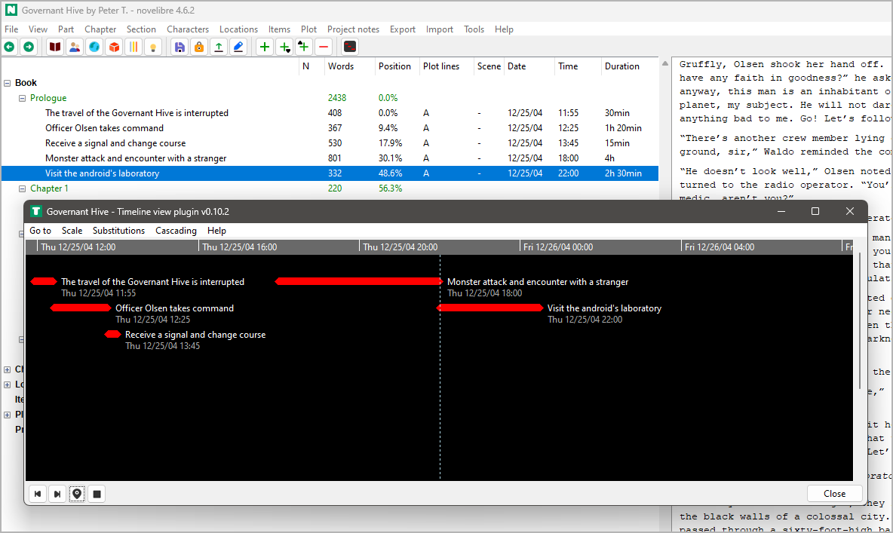

#  nv_tlview

The [novelibre](https://github.com/peter88213/novelibre/) Python program helps authors organize novels.  

*nv_tlview* is a plugin providing a timeline view with sections 
that are given a narrative date/day and time. 

---

## Requirements

- [novelibre](https://github.com/peter88213/novelibre/) version 4.7+

## Download and install

### Default: Executable Python zip archive

Download the latest release [nv_tlview_v1.8.0.pyzw](https://github.com/peter88213/nv_tlview/raw/main/dist/nv_tlview_v1.8.0.pyzw)

- Launch *nv_tlview_v1.8.0.pyzw* by double-clicking (Windows/Linux desktop),
- or execute `python nv_tlview_v1.8.0.pyzw` (Windows), resp. `python3 nv_tlview_v1.8.0.pyzw` (Linux) on the command line.

#### Important

Many web browsers recognize the download as an executable file and offer to open it immediately. 
This starts the installation.

However, depending on your security settings, your browser may 
initially  refuse  to download the executable file. 
In this case, your confirmation or an additional action is required. 
If this is not possible, you have the option of downloading 
the zip file. 

### Alternative: Zip file

The package is also available in zip format: [nv_tlview_v1.8.0.zip](https://github.com/peter88213/nv_tlview/raw/main/dist/nv_tlview_v1.8.0.zip)

- Extract the *nv_tlview_v1.8.0* folder from the downloaded zipfile "nv_tlview_v1.8.0.zip".
- Move into this new folder and launch *setup.pyw* by double-clicking (Windows/Linux desktop), 
- or execute `python setup.pyw` (Windows), resp. `python3 setup.pyw` (Linux) on the command line.

---

[Changelog](docs/changelog.md)

## Usage

See the [online manual](https://peter88213.github.io/nvhelp-en/nv_tlview/)

---

## Credits

- The logo is made using the free *Pusab* font by Ryoichi Tsunekawa, [Flat-it](http://flat-it.com/).
- The toolbar icons are based on the [Eva Icons](https://akveo.github.io/eva-icons/#/), published under the [MIT License](http://www.opensource.org/licenses/mit-license.php). The original black and white icons were adapted for this application by the maintainer. 

---

## License

This is Open Source software, and the *nv_tlview* plugin is licensed under GPLv3. See the
[GNU General Public License website](https://www.gnu.org/licenses/gpl-3.0.en.html) for more
details, or consult the [LICENSE](https://github.com/peter88213/nv_tlview/blob/main/LICENSE) file.
